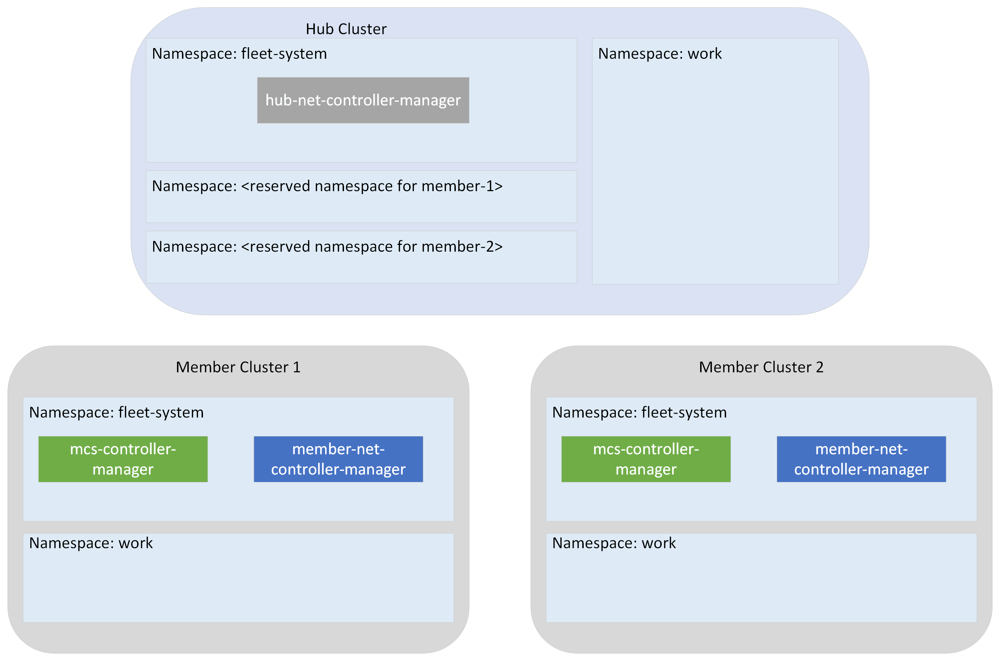

# Fleet-networking

 Fleet-networking provides following capabilities
- expose a Kubernetes service from a single cluster
- create a multi-cluster service that exposes endpoints from a number of Kubernetes clusters

## Architecture

The fleet networking consists of the following components:
- hub-net-controller-manager running in the hub cluster
- mcs-controller-manager running in the member clusters
- member-net-controller-manager running in the member clusters

The Controller Manager runs the various controllers built up on [controller-runtime](https://github.com/kubernetes-sigs/controller-runtime) by watching fleet networking resources.

## Constraints

- Assuming member clusters are Kubernetes clusters on the same virtual networking, 
  - Clusters on virtual network peers (virtual networks connected within same region)
  - Clusters on global virtual network peers (virtual networks connected across regions).
  - Non-overlapping pod CIDRs for all the above.
- Each member cluster could talk with hub cluster.

## Concepts

**Fleet**: A multi cluster solution that users use to manage Kubernetes clusters.

**Hub cluster**: An Kubernetes cluster that hosts the control plane of the fleet.

**Member cluster**: A Kubernetes cluster that is part of the fleet.

**Fleet-system Namespace**: A reserved namespace in all clusters for running Fleet networking controllers and putting internal resources.

**Reserved member cluster namespace in the hub cluster**: A reserved namespace in the hub cluster where a member cluster can access to communicate with the hub cluster.

## Quick Start

[This document](examples/getting-started/README.md) features a tutorial that explains how to set up and make use of the networking capabilities provided by Fleet.

## Contributing

This project welcomes contributions and suggestions.  Most contributions require you to agree to a
Contributor License Agreement (CLA) declaring that you have the right to, and actually do, grant us
the rights to use your contribution. For details, visit <https://cla.opensource.microsoft.com>.

When you submit a pull request, a CLA bot will automatically determine whether you need to provide
a CLA and decorate the PR appropriately (e.g., status check, comment). Simply follow the instructions
provided by the bot. You will only need to do this once across all repos using our CLA.

This project has adopted the [Microsoft Open Source Code of Conduct](https://opensource.microsoft.com/codeofconduct/).
For more information see the [Code of Conduct FAQ](https://opensource.microsoft.com/codeofconduct/faq/) or
contact [opencode@microsoft.com](mailto:opencode@microsoft.com) with any additional questions or comments.

## Trademarks

This project may contain trademarks or logos for projects, products, or services. Authorized use of Microsoft
trademarks or logos is subject to and must follow
[Microsoft's Trademark & Brand Guidelines](https://www.microsoft.com/en-us/legal/intellectualproperty/trademarks/usage/general).
Use of Microsoft trademarks or logos in modified versions of this project must not cause confusion or imply Microsoft sponsorship.
Any use of third-party trademarks or logos are subject to those third-party's policies.
