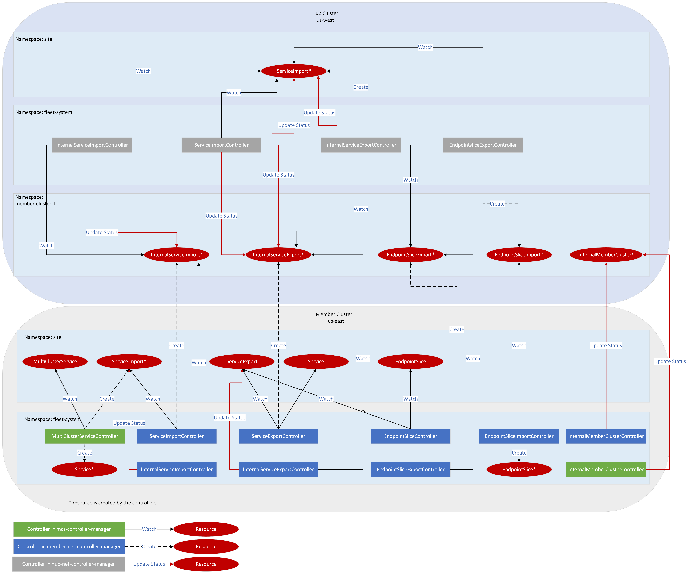

# Fleet Networking Architecture

## Overview

At a Kubernetes level, a fleet consists of a hub cluster and zero or more member clusters.  Custom resources and associated controllers,
residing both on the hub and member(s) govern the behavior of features of the fleet.  For more details, see [Fleet
Architecture](https://github.com/Azure/fleet/blob/master/docs/architecture.md).  This document gives an architectural overview of the
resources and controllers associated with fleet networking.

Fleets are configured such that each member *m* is granted access to resources within its corresponding *fleet-member-m* namespace on the
hub.  Controllers on both the hub and the member are able to read, write and watch these resources to communicate between each-other.  The
hub is not granted access to resources on any member, nor does any member have access to any other member.

The following fleet networking use cases are implemented:

1. **Multi-cluster service**: a single external L4 load balancer can front a service exported by one or more members, building on the
   Kubernetes [Multi-Cluster Services API](https://github.com/kubernetes-sigs/mcs-api)
   ([KEP-1645](https://github.com/kubernetes/enhancements/tree/master/keps/sig-multicluster/1645-multi-cluster-services-api)).

## Resources

### Multi-cluster service

1. [ServiceExport.networking.fleet.azure.com](https://github.com/Azure/fleet-networking/blob/master/api/v1alpha1/serviceexport_types.go#:~:text=type%20ServiceExport%20struct%20%7B)
   (member cluster, end user namespaces; hub cluster, end user namespaces if using cluster resource placement (CRP))

   Similar to
   [ServiceExport.multicluster.x-k8s.io](https://github.com/kubernetes-sigs/mcs-api/blob/master/pkg/apis/v1alpha1/serviceexport.go#:~:text=type%20ServiceExport%20struct%20%7B).
   Declares that the *Service* with the same name and namespace as the *ServiceExport* should be consumable from other clusters in the
   fleet.  Status.  Owned by the end user.

1. [ServiceImport.networking.fleet.azure.com](https://github.com/Azure/fleet-networking/blob/master/api/v1alpha1/serviceimport_types.go#:~:text=type%20ServiceImport%20struct%20%7B)
   (member cluster, end user namespaces; hub cluster, end user namespaces; not eligible for cluster resource placement (CRP))

   Confusingly, *ServiceImport* has two distinct uses:

   1. On a member cluster, similar to
      [ServiceImport.multicluster.x-k8s.io](https://github.com/kubernetes-sigs/mcs-api/tree/master/pkg/apis/v1alpha1/serviceimport.go#:~:text=type%20ServiceImport%20struct%20%7B).
      Describes a service imported from one or more clusters in the fleet.  Status.  Owned by the end user.

   1. On a hub cluster, used in an end user namespace to aggregate the set of clusters exporting the service and check for port conflicts.
      Owned by (hub) internalserviceexport controller.

   *ServiceImports* are not eligible for cluster resource placement (CRP).

1. [MultiClusterService.networking.fleet.azure.com](https://github.com/Azure/fleet-networking/blob/master/api/v1alpha1/multiclusterservice_types.go#:~:text=type%20MultiClusterService%20struct%20%7B)
   (member cluster, end user namespaces; hub cluster, end user namespaces if using cluster resource placement (CRP))

   Declares that an (external) L4 load balancer should be created for a given ServiceImport, balancing connections to endpoints in all
   clusters that export the given Service.  Owned by the end user.

1. [InternalServiceExport.networking.fleet.azure.com](https://github.com/Azure/fleet-networking/blob/master/api/v1alpha1/internalserviceexport_types.go#:~:text=type%20InternalServiceExport%20struct%20%7B)
   (hub cluster, fleet-member-\* namespaces)

   Internal mirror of a ServiceExport, hosted in fleet-member-\* namespaces for access by the hub cluster.  Owned by the (member)
   serviceexport controller.

1. [EndpointSliceExport.networking.fleet.azure.com](https://github.com/Azure/fleet-networking/blob/master/api/v1alpha1/endpointsliceexport_types.go#:~:text=type%20EndpointSliceExport%20struct%20%7B)
   (hub cluster, fleet-member-\* namespaces)

   Internal mirror of an EndpointSlice of an exported service, hosted in fleet-member-\* namespaces for access by the hub cluster.  Owned by
   the (member) endpointsliceexport controller.

1. [InternalServiceImport.networking.fleet.azure.com](https://github.com/Azure/fleet-networking/blob/master/api/v1alpha1/internalserviceimport_types.go#:~:text=type%20InternalServiceImport%20struct%20%7B)
   (hub cluster, fleet-member-\* namespaces)

   Internal mirror of a ServiceImport, hosted in fleet-member-\* namespaces for communication with member clusters.  Owned by the
   (member) serviceimport controller but populated by the (hub) internalserviceimport controller.

1. [EndpointSliceImport.networking.fleet.azure.com](https://github.com/Azure/fleet-networking/blob/master/api/v1alpha1/endpointsliceimport_types.go#:~:text=type%20EndpointSliceImport%20struct%20%7B)
   (hub cluster, fleet-member-\* namespaces)

   Internal mirror of an EndpointSliceImport, hosted in fleet-member-\* namespaces for communication with member clusters.  Owned by the
   (hub) endpointsliceexport controller.

## Controllers

### Multi-cluster service

The following controllers are implemented for the Multi-cluster service use case:

1. [pkg/controllers/hub/endpointsliceexport](https://github.com/Azure/fleet-networking/tree/main/pkg/controllers/hub/endpointsliceexport) (hub cluster)

1. [pkg/controllers/hub/internalserviceexport](https://github.com/Azure/fleet-networking/tree/main/pkg/controllers/hub/internalserviceexport) (hub cluster)

1. [pkg/controllers/hub/internalserviceimport](https://github.com/Azure/fleet-networking/tree/main/pkg/controllers/hub/internalserviceimport) (hub cluster)

1. [pkg/controllers/hub/serviceimport](https://github.com/Azure/fleet-networking/tree/main/pkg/controllers/hub/serviceimport) (hub cluster)

1. [pkg/controllers/member/endpointslice](https://github.com/Azure/fleet-networking/tree/main/pkg/controllers/member/endpointslice) (member cluster)

1. [pkg/controllers/member/endpointsliceexport](https://github.com/Azure/fleet-networking/tree/main/pkg/controllers/member/endpointsliceexport) (member cluster)

1. [pkg/controllers/member/endpointsliceimport](https://github.com/Azure/fleet-networking/tree/main/pkg/controllers/member/endpointsliceimport) (member cluster)

1. [pkg/controllers/member/internalmembercluster](https://github.com/Azure/fleet-networking/tree/main/pkg/controllers/member/internalmembercluster) (member cluster)

1. [pkg/controllers/member/internalserviceexport](https://github.com/Azure/fleet-networking/tree/main/pkg/controllers/member/internalserviceexport) (member cluster)

1. [pkg/controllers/member/internalserviceimport](https://github.com/Azure/fleet-networking/tree/main/pkg/controllers/member/internalserviceimport) (member cluster)

1. [pkg/controllers/member/serviceexport](https://github.com/Azure/fleet-networking/tree/main/pkg/controllers/member/serviceexport) (member cluster)

1. [pkg/controllers/member/serviceimport](https://github.com/Azure/fleet-networking/tree/main/pkg/controllers/member/serviceimport) (member cluster)

1. [pkg/controllers/multiclusterservice](https://github.com/Azure/fleet-networking/tree/main/pkg/controllers/multiclusterservice) (member cluster)

