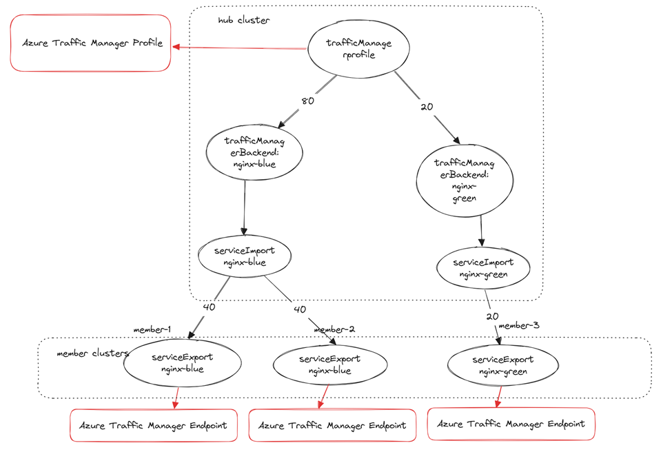

# Multi-cluster DNS-based global load balancing

## Overview

Fleet-networking provides an automated way to expose the multi-cluster application via [Azure Traffic Manager](https://learn.microsoft.com/en-us/azure/traffic-manager/traffic-manager-overview).

`TrafficManagerProfile` is a custom resource definition (CRD) that allows you to manage a Traffic Manager Profile by using weighted routing method

and `TrafficManagerBackend` allows you to manage the traffic manager endpoints using cloud native way.

To expose a multi-cluster service, a user needs to create a `trafficManagerProfile` and a `trafficManagerBackend` CR, similar to the example below, 

in the hub cluster:

```yaml
apiVersion: networking.fleet.azure.com/v1beta1
kind: TrafficManagerProfile
metadata:
  name: nginx-profile
  namespace: test-app
spec:
  resourceGroup: "test-resource-group"
  monitorConfig:
    port: 80
---
apiVersion: networking.fleet.azure.com/v1beta1
kind: TrafficManagerBackend
metadata:
  name: nginx-backend
  namespace: test-app
spec:
  profile:
    name: "nginx-profile"
  backend:
    name: "nginx-service"
  weight: 100
```

To export a multi-cluster service, `TrafficManagerProfile` and `TrafficManagerBackend` should be created within namespace that the service resides in - that is, they reference the `Service` with the same namespace name as the traffic manager resources.

The following diagram illustrates the relationship between the Azure Traffic Manager resources and Kubernetes resources:


> Note: When you delete the `TrafficManagerProfile`, the corresponding Azure Traffic Manager resources (including any endpoints)
> will be deleted as well and the accepted condition of `TrafficManagerBackend` which are referring to the `TrafficManagerProfile` will become false. 

## User stories
**Single Service Deployed to Multiple Clusters**

I have deployed my stateless service to multiple clusters for redundancy or scale.
Requests to my replicated service should seamlessly transition (within SLO for dropped requests) between instances of my service in case of failure or removal without action by or impact on the caller.

**Application Migration**

I would like to migrate my applications from the existing clusters to new clusters without any downtime and gradually shift the traffic to the new clusters.

## Control The Traffic

There are two ways to control the weight of the multi-cluster service for Azure traffic manager profile:
1. To control the weight per exported service, use the `weight` on the `trafficManagerBackend` CR.
2. To control the weight per cluster, add the annotation `networking.fleet.azure.com/weight` on the `serviceExport` CR.

The weight of actual Azure Traffic Manager endpoint created for a single cluster is the ceiling value of a number computed 
as `trafficManagerBackend` weight/(sum of all `serviceExport` weights behind the `trafficManagerBackend`) * weight of `serviceExport` of a single cluster. 

For example, if the trafficManagerBackend weight is 500 and there are two serviceExports from cluster-1 (weight: 100) and cluster-2 (weight: 200)
defined for the service.
As a result, two endpoints will be created.
The weight of endpoint from cluster-1 is 100/(100+200)*500 = 167, and the weight of cluster-2 is 200/(100+200)*500 = 334.
There may be slight deviations from the exact proportions defined in the serviceExports due to ceiling calculations.

You can set the weight as 0 to disable the traffic for a single cluster using `serviceExport` weight or the whole service using
`trafficManagerBackend` weight. By default, it sets to 1.

Sample trafficManagerBackend status:

```yaml
  status:
    conditions:
    - lastTransitionTime: "2025-04-17T02:19:04Z"
      message: 2 service(s) exported from clusters have been accepted as Traffic Manager
        endpoints
      observedGeneration: 1
      reason: Accepted
      status: "True"
      type: Accepted
    endpoints:
    - from:
        cluster: aks-member-1
        weight: 100 # original weight of the serviceExport
      name: fleet-d0c68379-d358-4c5b-bd1b-2121f6bfee50#nginx-service#aks-member-1
      resourceID: /subscriptions/your-sub/resourceGroups/your-rg/providers/Microsoft.Network/trafficManagerProfiles/fleet-a8fa8ef2-9f3a-444e-8f9c-56d7a82e25dd/azureEndpoints/fleet-d0c68379-d358-4c5b-bd1b-2121f6bfee50#nginx-service#aks-member-1
      target: fleet-aks-member-1.eastus2euap.cloudapp.azure.com
      weight: 100 # actual weight of the endpoint
    - from:
        cluster: aks-member-5
        weight: 1 # original weight of the serviceExport
      name: fleet-d0c68379-d358-4c5b-bd1b-2121f6bfee50#nginx-service#aks-member-5
      resourceID: /subscriptions/your-sub/resourceGroups/your-rg/providers/Microsoft.Network/trafficManagerProfiles/fleet-a8fa8ef2-9f3a-444e-8f9c-56d7a82e25dd/azureEndpoints/fleet-d0c68379-d358-4c5b-bd1b-2121f6bfee50#nginx-service#aks-member-5
      target: fleet-aks-member-5.eastus2euap.cloudapp.azure.com
      weight: 1 # actual weight of the endpoint
```
Note: In the trafficManagerBackend, there are two weights in the endpoint. The endpoints[*].from.weight is the original weight of the serviceExport configured by the annotation while endpoints[*].weight is the actual weight of the endpoint.

## Constraints

The exported `Service` must be exposed via an Azure public ip address, which has a DNS name assigned to be used in a 
Traffic Manager profile.

A programmed trafficManagerProfile sample:
```yaml
  status:
    conditions:
    - lastTransitionTime: "2025-03-13T12:37:01Z"
      message: Successfully configured the Azure Traffic Manager profile
      observedGeneration: 2
      reason: Programmed
      status: "True"
      type: Programmed
    dnsName: team-a-nginx-nginx-profile.trafficmanager.net
    resourceID: /subscriptions/your-sub/resourceGroups/your-rg/providers/Microsoft.Network/trafficManagerProfiles/fleet-e1198839-b211-4df2-8e01-31a666c6d08f
k
```
An accepted trafficManagerBackend sample:

```yaml
status:
    conditions:
    - lastTransitionTime: "2025-03-16T12:03:15Z"
      message: 2 service(s) exported from clusters have been accepted as Traffic Manager
        endpoints
      observedGeneration: 1
      reason: Accepted
      status: "True"
      type: Accepted
    endpoints:
    - from:
        cluster: aks-member-3
        weight: 1
      name: fleet-beac47f8-09c0-4cd5-96f9-1858eaf4a865#nginx-service-eastus2euap#aks-member-3
      target: fleet-aks-member-3-eastus2euap.eastus2euap.cloudapp.azure.com
      weight: 50
    - from:
        cluster: aks-member-1
        weight: 1
      name: fleet-beac47f8-09c0-4cd5-96f9-1858eaf4a865#nginx-service-eastus2euap#aks-member-1
      target: fleet-aks-member-1-eastus2euap.eastus2euap.cloudapp.azure.com
      weight: 50
```

## Authentication and Authorization

For networking member agents operating within the member cluster, the necessary permissions should be in place to access the public IP address.

To support the traffic manager feature, networking hub agent needs to have the following permissions:
* `Microsoft.Network/publicIPAddresses/read` on the public IP address resource created in the member clusters.
* Azure Traffic Manager permissions on the resource group where the traffic manager profile is created.

    ```
    "Microsoft.Network/trafficManagerProfiles/read",
    "Microsoft.Network/trafficManagerProfiles/write",
    "Microsoft.Network/trafficManagerProfiles/delete",
    "Microsoft.Network/trafficManagerProfiles/azureEndpoints/read",
    "Microsoft.Network/trafficManagerProfiles/azureEndpoints/write",
    "Microsoft.Network/trafficManagerProfiles/azureEndpoints/delete"
    ```
Please refer to the [traffic-manager-permission-setup how-to](../../howtos/traffic-manager-permissions-setup.md) for more information about the permission setup.
