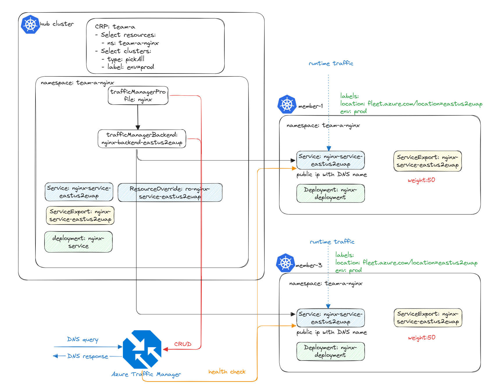

# Deploying a Multi-Cluster Application using fleet APIs

## Introduction 🚀
In this session, we will walk through how to deploy a Nginx server seamlessly across multiple production clusters in **eastus2euap** while routing traffic intelligently using **Azure Traffic Manager**.



## Prerequisites
Before we begin, ensure you have the following:
- An **Azure Kubernetes Fleet Manager** set up with two members.
- The **kubectl** CLI installed and configured.
- A resource group created for the Traffic Manager Profile.
- Azure Traffic Manager permission set up for **Azure Kubernetes Fleet Manager**.

---

## Step 1: Deploy Nginx
First, create a namespace to house the Nginx deployment and its associated deployments in the hub cluster:

> Note: test file located [here](../testfiles/deployment.yaml).

```yaml
apiVersion: v1
kind: Namespace
metadata:
  name: team-a-nginx
---
apiVersion: apps/v1
kind: Deployment
metadata:
  name: nginx-deployment
  namespace: team-a-nginx
spec:
  replicas: 2
  selector:
    matchLabels:
      app: nginx
  template:
    metadata:
      labels:
        app: nginx
    spec:
      containers:
        - name: nginx
          image: nginx:1.16.1
          ports:
            - containerPort: 80
```

Apply the deployment:
```sh
kubectl apply -f deployment.yaml
```

---

## Step 2: Deploy a Load Balancer Service and ServiceExport
Create a LoadBalancer service and define a **ServiceExport** to make the service accessible within the fleet:

> Note: test file located [here](../testfiles/eastus2euap/nginx-service-eastus2euap.yaml).

```yaml
apiVersion: v1
kind: Service
metadata:
  name: nginx-service-eastus2euap
  namespace: team-a-nginx
spec:
  selector:
    app: nginx
  ports:
    - protocol: TCP
      port: 80
      targetPort: 80
  type: LoadBalancer
---
apiVersion: networking.fleet.azure.com/v1alpha1
kind: ServiceExport
metadata:
  name: nginx-service-eastus2euap
  namespace: team-a-nginx
```

Apply the configuration:
```sh
kubectl apply -f eastus2euap/nginx-service-eastus2euap.yaml
```

---

## Step 3: Use resourceOverride for Unique DNS Labels
Each service needs a unique DNS label so that it can be exposed via Azure Traffic Manager. Use **resourceOverride** to modify the service definition per cluster:

> Note: test file located [here](../testfiles/eastus2euap/ro-nginx-service-eastus2euap.yaml).

```yaml
apiVersion: placement.kubernetes-fleet.io/v1alpha1
kind: ResourceOverride
metadata:
  name: ro-nginx-service-eastus2euap
  namespace: team-a-nginx
spec:
  placement:
    name: crp-team-a
  resourceSelectors:
    -  group: ""
       kind: Service
       version: v1
       name: nginx-service-eastus2euap
  policy:
    overrideRules:
      - clusterSelector:
          clusterSelectorTerms:
            - labelSelector:
                matchLabels:
                  fleet.azure.com/location: eastus2euap
        jsonPatchOverrides:
          - op: add
            path: /metadata/annotations
            value:
              {"service.beta.kubernetes.io/azure-dns-label-name":"fleet-${MEMBER-CLUSTER-NAME}-eastus2euap"}
```
> Note: Please update the dns label name to match your specific requirements, and the "fleet-${MEMBER-CLUSTER-NAME}-eastus2euap" may be not available.


Apply the configuration:
```sh
kubectl apply -f eastus2euap/ro-nginx-service-eastus2euap.yaml
```
---

## Step 4: Define clusterResourcePlacement
Use **clusterResourcePlacement** to deploy Nginx across multiple clusters:

> Note: test file located [here](../testfiles/crp.yaml).

```yaml
apiVersion: placement.kubernetes-fleet.io/v1
kind: ClusterResourcePlacement
metadata:
  name: crp-team-a
spec:
  resourceSelectors:
    - group: ""
      kind: Namespace
      name: team-a-nginx
      version: v1
  policy:
    placementType: PickAll
    affinity:
      clusterAffinity:
        requiredDuringSchedulingIgnoredDuringExecution:
          clusterSelectorTerms:
            - labelSelector:
                matchLabels:
                  env: prod
```

Apply the configuration:
```sh
kubectl apply -f crp.yaml
```

---

## Step 5: Configure Azure Traffic Manager
Define **Traffic Manager Profile** and **Traffic Manager Backend** for global traffic distribution once the resources are available on the members.

### Traffic Manager Profile
> Note: test file located [here](../testfiles/nginx-profile.yaml).

```yaml
apiVersion: networking.fleet.azure.com/v1beta1
kind: TrafficManagerProfile
metadata:
  name: nginx-profile
  namespace: team-a-nginx
spec:
  resourceGroup: "your-fleet-atm-rg"
  monitorConfig:
    port: 80
```

> Note: Please update the profile or namespace name if the dns name of the profile is not available.

### Traffic Manager Backend

> Note: test file located [here](../testfiles/nginx-backend-eastus2euap.yaml).
```yaml
apiVersion: networking.fleet.azure.com/v1beta1
kind: TrafficManagerBackend
metadata:
  name: nginx-backend-eastus2euap
  namespace: team-a-nginx
spec:
  profile:
    name: "nginx-profile"
  backend:
    name: "nginx-service-eastus2euap"
  weight: 100
```

Apply the configurations:
```sh
kubectl apply -f nginx-profile.yaml
kubectl apply -f testfiles/nginx-backend-eastus2euap.yaml
```

---

## **Conclusion 🎯**
By completing these steps, you now have:
- Deployed Nginx across multiple clusters.
- Assigned unique DNS labels per cluster.
- Published the service across clusters using **ServiceExport**.
- Integrated **Azure Traffic Manager** for intelligent global traffic routing.

Now, users can access the **team-a-nginx-nginx-profile.trafficmanager.net** endpoint, and traffic will automatically distribute between clusters, with failover handling in case of failures.

🚀 Happy Deploying!

