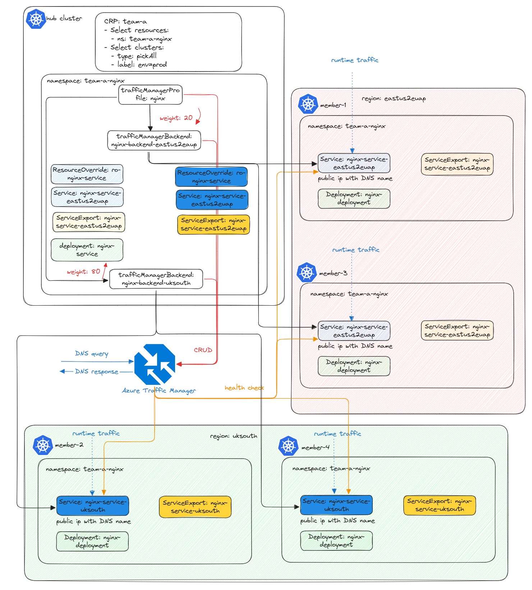

# Application Migration Across Regions

## Introduction 🚀
Welcome to this session, where we’ll walk through the step-by-step migration of an application from one region to another. 
This process is important for scalability, performance optimization, and capacity planning.

We will migrate both the application and its traffic to a new region: `uksouth`.



## Prerequisites
Before we begin, Before we begin, ensure you have the following:
- Finished the session on [deploying a multi-cluster application](../session-build-multi-cluster-app/README.md) using fleet APIs.
- Created two clusters `aks-member-2` & `aks-member-4` in the `uksouth` region and joined as part of fleet.

---

## Quick Recap: What We've Done So Far ✅

1. **Set Up:** We set up a service and deployment in the `team-a-nginx` namespace.
2. **Propagation:** We used `clusterResourcePlacement` to propagate them across clusters labeled with `env=prod`.
3. **Traffic Exposure:** We assigned a unique DNS name using the `override` API and leveraged **Azure Traffic Manager** for traffic exposure. Currently, traffic is served by `aks-member-1` and `aks-member-3`.
---

## Step 1: Update Resource Overrides for the existing region

Create and update `ResourceOverride` to ensure that the `eastus2euap` service & serviceExport won't be propagated to `uksouth`.

> Note: test file located [here](../testfiles/eastus2euap/ro-nginx-service-eastus2euap.yaml).

```yaml
apiVersion: placement.kubernetes-fleet.io/v1alpha1
kind: ResourceOverride
metadata:
  name: ro-nginx-service-eastus2euap
  namespace: team-a-nginx
spec:
  placement:
    name: crp-team-a
  resourceSelectors:
    -  group: ""
       kind: Service
       version: v1
       name: nginx-service-eastus2euap
  policy:
    overrideRules:
      - clusterSelector:
          clusterSelectorTerms:
            - labelSelector:
                matchLabels:
                  fleet.azure.com/location: eastus2euap
        jsonPatchOverrides:
          - op: add
            path: /metadata/annotations
            value:
              {"service.beta.kubernetes.io/azure-dns-label-name":"fleet-${MEMBER-CLUSTER-NAME}-eastus2euap"}
      - clusterSelector:
          clusterSelectorTerms:
            - labelSelector:
                matchExpressions:
                - key: fleet.azure.com/location
                  operator: NotIn
                  values:
                    - eastus2euap
        overrideType: Delete

```

> Note: test file located [here](../testfiles/eastus2euap/ro-nginx-service-export-eastus2euap.yaml).

```yaml
apiVersion: placement.kubernetes-fleet.io/v1alpha1
kind: ResourceOverride
metadata:
  name: ro-nginx-service-export-eastus2euap
  namespace: team-a-nginx
spec:
  placement:
    name: crp-team-a
  resourceSelectors:
    -  group: networking.fleet.azure.com
       kind: ServiceExport
       version: v1alpha1
       name: nginx-service-eastus2euap
  policy:
    overrideRules:
      - clusterSelector:
          clusterSelectorTerms:
            - labelSelector:
                matchExpressions:
                  - key: fleet.azure.com/location
                    operator: NotIn
                    values:
                      - eastus2euap
        overrideType: Delete
```

Apply the configurations:
```sh
kubectl apply -f eastus2euap/ro-nginx-service-eastus2euap.yaml
kubectl apply -f eastus2euap/ro-nginx-service-export-eastus2euap.yaml
```

## Step 2: Create another service to expose the existing **Nginx deployment** in the new region.

> Note: test file located [here](../testfiles/uksouth/..).

Apply the configurations:
```sh
kubectl apply -f uksouth/ro-nginx-service-uksouth.yaml
kubectl apply -f uksouth/ro-nginx-service-export-uksouth.yaml
kubectl apply -f uksouth/nginx-service-uksouth.yaml
```

## Step 3: Add label "env=prod" to uksouth clusters

To ensure that `aks-member-2` & `aks-member-4` is recognized as a production environment, we need to add the label `env=prod` to it. This will allow the `clusterResourcePlacement` to propagate the resources correctly.

```sh
kubectl label cluster aks-member-2 env=prod
kubectl label cluster aks-member-4 env=prod
```

To check the status of the `clusterResourcePlacement`, we will run the following command. It's essential to ensure the resources are applied and available on both clusters before we shift the traffic.

```sh
kubectl get crp crp-team-a -o yaml
```

---

## Step 4: Add a New Traffic Manager Backend
- Once resources are ready, add a new `trafficManagerBackend` linked to the existing `trafficManagerProfile`.

> Note: test file located [here](../testfiles/nginx-backend-uksouth.yaml).

```yaml
apiVersion: networking.fleet.azure.com/v1beta1
kind: TrafficManagerBackend
metadata:
  name: nginx-backend-uksouth
  namespace: team-a-nginx
spec:
  profile:
    name: "nginx-profile"
  backend:
    name: "nginx-service-uksouth"
  weight: 10
```

Apply the configuration:
```sh
kubectl apply -f nginx-backend-uksouth.yaml
```

## Step 5: Shift Traffic Dynamically
- Adjust backend weights in `trafficManagerBackend` to gradually shift traffic between regions.
- Monitor traffic distribution by using `kubectl get tmb -n team-a-nginx -o yaml` to ensure a smooth transition.
- Delete the existing `trafficManagerBackend` nginx-backend-eastus2euap for `aks-member-1` and `aks-member-3` so that the new connections won't be routed to the eastus2euap region.

> Note: There are multiple ways to adjust the weight on the trafficManagerBackends. For example, you can fix one of weight and adjust the other one. Or you can update both.
> For example, you can keep the weight of `nginx-backend-eastus2euap` to 100 and gradually increase the weight of `nginx-backend-uksouth` from 10 to 1000.
> So that most of the traffic can be shifted to the new regions before deleting endpoints from eastus2euap region.

## Step 6: Cleanup & Finalization
- Remove the env label from the `aks-member-1` & `aks-member-3` or add [a taint on these two members](https://github.com/Azure/fleet/blob/main/docs/howtos/taint-toleration.md) so that the cluster won't be picked by the `clusterResourcePlacement` again.
- To ensure the application won't be disrupted, we can create the `ClusterResourcePlacementDisruptionBudget` for the protection.

> Note: test file located [here](../testfiles/placement-disruption-budget.yaml).
```yaml
apiVersion: placement.kubernetes-fleet.io/v1beta1
kind: ClusterResourcePlacementDisruptionBudget
metadata:
  name: crp-team-a
spec:
  minAvailable: 2
```
Apply the configuration:
```sh
kubectl apply -f placement-disruption-budget.yaml
```
- Safely remove application workloads and services from `aks-member-1` and `aks-member-3` once all traffic has shifted and all the client DNS caches are refreshed.

> Note: test file located [here](../testfiles/placement-eviction-member-1.yaml).

```yaml
apiVersion: placement.kubernetes-fleet.io/v1beta1
kind: ClusterResourcePlacementEviction
metadata:
  name: crp-team-a-member-1-eviction
spec:
  placementName: crp-team-a
  clusterName: aks-member-1

```
> Note: test file located [here](../testfiles/placement-eviction-member-3.yaml).

```yaml
apiVersion: placement.kubernetes-fleet.io/v1beta1
kind: ClusterResourcePlacementEviction
metadata:
  name: crp-team-a-member-3-eviction
spec:
  placementName: crp-team-a
  clusterName: aks-member-3
```
Apply the configuration:
```sh
kubectl apply -f placement-eviction-member-1.yaml
kubectl apply -f placement-eviction-member-3.yaml
```

By checking the execution status, you can use the following command:
```sh
kubectl get crpe
```

---

## **Conclusion 🎯**
Now we have seamlessly migrated our application while ensuring **zero downtime** and **smooth traffic transition**. 🚀

