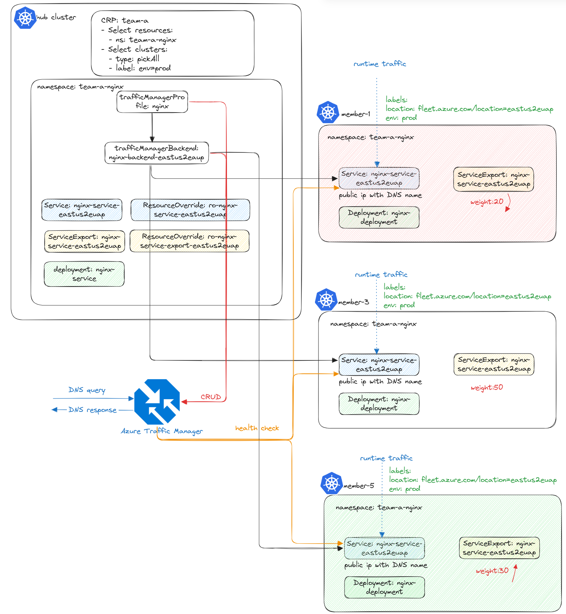

# Seamless Cluster Migration and Traffic Control

## Introduction 🚀
Welcome to this session on seamless cluster migration and traffic control!

Today we’ll guide you through migrating your application to another cluster using fleet APIs, ensuring smooth traffic management across clusters.



## Prerequisites
Before we begin, Before we begin, ensure you have the following:
- Finished the session on [deploying a multi-cluster application](../session-build-multi-cluster-app/README.md) using fleet APIs.
- Created another cluster `aks-member-5` as a Replacement for `aks-member-1` and joined as part of the fleet.
- Each member cluster has a label `cluster-name: <member-name>`.

---

## Quick Recap: What We've Done So Far ✅

1. **Set Up:** We set up a service and deployment in the `team-a-nginx` namespace.
2. **Propagation:** We used `clusterResourcePlacement` to propagate them across clusters labeled with `env=prod`.
3. **Traffic Exposure:** We assigned a unique DNS name using the `override` API and leveraged **Azure Traffic Manager** for traffic exposure. Currently, traffic is served by `aks-member-1` and `aks-member-3`.

---

## Step 1: Disable the traffic on the new cluster Using `resourceOverride`

First, we need to disable the traffic on the new cluster `aks-member-5` using the `resourceOverride` API. This will ensure that the new cluster is not receiving any traffic until we are ready to switch over.

> Note: test file located [here](../testfiles/eastus2euap/ro-nginx-service-export-eastus2euap.yaml).

```yaml
apiVersion: placement.kubernetes-fleet.io/v1alpha1
kind: ResourceOverride
metadata:
  name: ro-nginx-service-export-eastus2euap
  namespace: team-a-nginx
spec:
  placement:
    name: crp-team-a
  resourceSelectors:
    -  group: networking.fleet.azure.com
       kind: ServiceExport
       version: v1alpha1
       name: nginx-service-eastus2euap
  policy:
    overrideRules:
      - clusterSelector:
          clusterSelectorTerms:
            - labelSelector:
                matchLabels:
                  cluster-name: member-1
        jsonPatchOverrides:
          - op: add
            path: /metadata/annotations
            value:
              { "networking.fleet.azure.com/weight": "50" }
      - clusterSelector:
          clusterSelectorTerms:
            - labelSelector:
                matchLabels:
                  cluster-name: member-3
        jsonPatchOverrides:
          - op: add
            path: /metadata/annotations
            value:
              { "networking.fleet.azure.com/weight": "50" }
      - clusterSelector:
          clusterSelectorTerms:
            - labelSelector:
                matchLabels:
                  cluster-name: member-5
        jsonPatchOverrides:
          - op: add
            path: /metadata/annotations
            value:
              { "networking.fleet.azure.com/weight": "0" }
```

Apply the configuration:
```sh
kubectl apply -f eastus2euap/ro-nginx-service-export-eastus2euap.yaml
```
---

## Step 2: Add label "env=prod" to `aks-member-5`

To ensure that `aks-member-5` is recognized as a production environment, we need to add the label `env=prod` to it. This will allow the `clusterResourcePlacement` to propagate the resources correctly.

```sh
kubectl label cluster aks-member-5 env=prod
```

To check the status of the `clusterResourcePlacement`, we will run the following command. It's essential to ensure the resources are applied and available on the cluster before we shift the traffic.
```sh
kubectl get crp crp-team-a -o yaml
```

---

## Step 3: Adjust Traffic Weight Using `resourceOverride`
- Gradually shift requests from `aks-member-1` to `aks-member-5` by modifying the traffic weights in `serviceExport`.
- Monitor traffic distribution by using `kubectl get tmb nginx-backend-eastus2euap -n team-a-nginx -o yaml` to ensure a smooth transition.

```yaml
apiVersion: placement.kubernetes-fleet.io/v1alpha1
kind: ResourceOverride
metadata:
  name: ro-nginx-service-export-eastus2euap
  namespace: team-a-nginx
spec:
  placement:
    name: crp-team-a
  resourceSelectors:
    -  group: networking.fleet.azure.com
       kind: ServiceExport
       version: v1alpha1
       name: nginx-service-eastus2euap
  policy:
    overrideRules:
      - clusterSelector:
          clusterSelectorTerms:
            - labelSelector:
                matchLabels:
                  cluster-name: member-1
        jsonPatchOverrides:
          - op: add
            path: /metadata/annotations
            value:
              { "networking.fleet.azure.com/weight": "0" }
      - clusterSelector:
          clusterSelectorTerms:
            - labelSelector:
                matchLabels:
                  cluster-name: member-3
        jsonPatchOverrides:
          - op: add
            path: /metadata/annotations
            value:
              { "networking.fleet.azure.com/weight": "50" }
      - clusterSelector:
          clusterSelectorTerms:
            - labelSelector:
                matchLabels:
                  cluster-name: member-5
        jsonPatchOverrides:
          - op: add
            path: /metadata/annotations
            value:
              { "networking.fleet.azure.com/weight": "50" }
```
---

## Step 4: Clean Up Resources Using the `eviction` API
- Remove the env label from the `aks-member-1` or add [a taint on the member](https://github.com/Azure/fleet/blob/main/docs/howtos/taint-toleration.md) so that the cluster won't be picked by the `clusterResourcePlacement` again.
- Safely remove application workloads and services from `aks-member-1` once all traffic has shifted and all the client DNS caches are refreshed.

> Note: test file located [here](../testfiles/placement-eviction-member-1.yaml).

```yaml
apiVersion: placement.kubernetes-fleet.io/v1beta1
kind: ClusterResourcePlacementEviction
metadata:
  name: crp-team-a-member-1-eviction
spec:
  placementName: crp-team-a
  clusterName: aks-member-1

```

Apply the configuration:
```sh
kubectl apply -f placement-eviction-member-1.yaml
```

By checking the execution status, you can use the following command:
```sh
kubectl get crpe
```

---

## **Conclusion 🎯**
By the end of this session, you now have a hands-on understanding of:
- Cluster migration using `clusterResourcePlacement`.
- Traffic management with `serviceExport` weight adjustments.
- Safe decommissioning of a cluster using the `eviction` API.

Ensuring your applications remain **highly available** and **resilient** is crucial! 🚀

