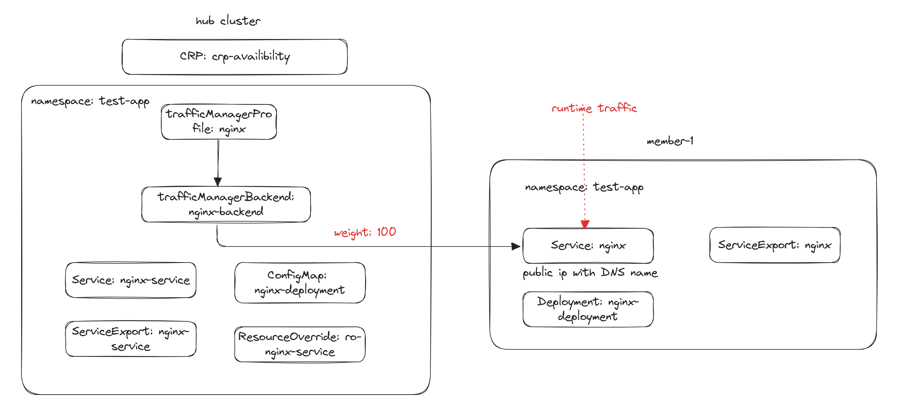
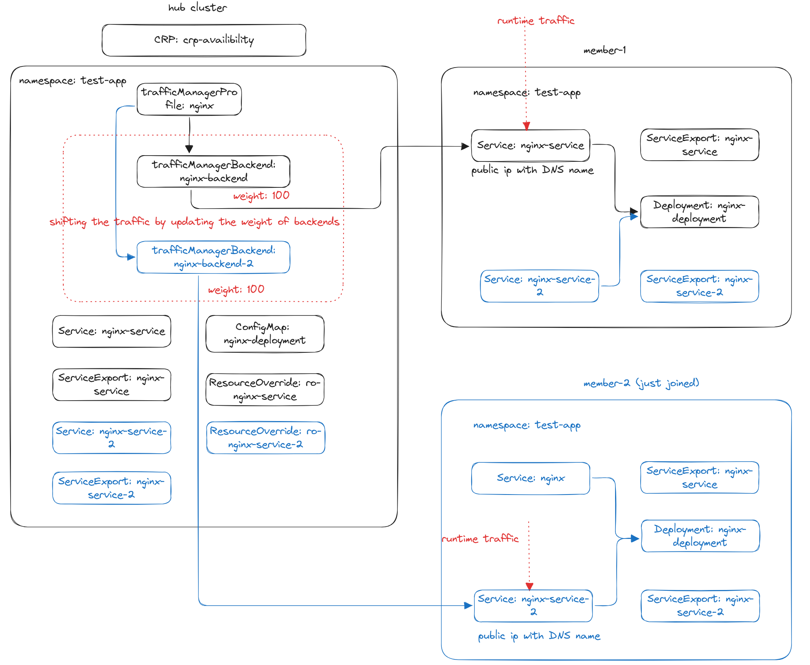
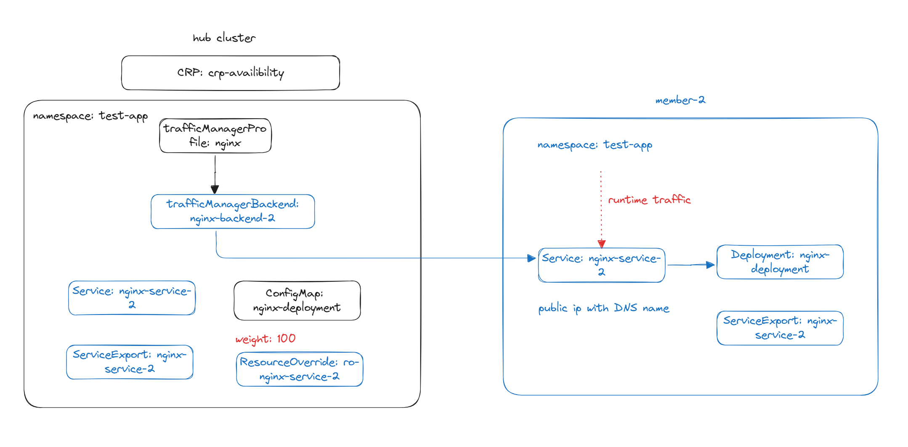

# Tutorial: Migrating Application Resources to Clusters without Downtime

This tutorial will guide you through the process of migrating application resources to a new cluster without any downtime using [KubeFleet](https://github.com/Azure/fleet) and networking related features. 
This is useful when you need to migrate resources to a new cluster for any reason, such as upgrading the cluster version or moving to a different region.

## Scenario
Your fleet consists of the following clusters:

1. Member Cluster 1 with label "cluster-name: member-1"

You have a set of application resources running on Member Cluster 1 that you want to migrate to Member Cluster 2.
Meanwhile, you want to ensure that the application remains available and accessible during the migration process.

## Current Application Resources


The following resources are currently deployed in the hub cluster and use clusterResourcePlacement API to place them to the Member Cluster 1:

### Service
> Note: Service test file located [here](./testfiles/nginx-service.yaml).

```yaml
apiVersion: v1
kind: Service
metadata:
  name: nginx-service
  namespace: test-app
spec:
  selector:
    app: nginx
  ports:
    - protocol: TCP
      port: 80
      targetPort: 80
  type: LoadBalancer
---
apiVersion: networking.fleet.azure.com/v1alpha1
kind: ServiceExport
metadata:
  name: nginx-service
  namespace: test-app
```
The service is exposed using public IP and assigned a DNS name using [ro-nginx-service.yaml](./testfiles/ro-nginx-service.yaml)
and is visible to the fleet by creating ServiceExport.

```yaml
apiVersion: placement.kubernetes-fleet.io/v1alpha1
kind: ResourceOverride
metadata:
  name: ro-nginx-service
  namespace: test-app
spec:
  placement:
    name: crp-availability
  resourceSelectors:
    -  group: ""
       kind: Service
       version: v1
       name: nginx-service
  policy:
    overrideRules:
      - clusterSelector:
          clusterSelectorTerms:
            - labelSelector: {} # select all the clusters
        jsonPatchOverrides:
          - op: add
            path: /metadata/annotations
            value:
              {"service.beta.kubernetes.io/azure-dns-label-name":"fleet-${MEMBER-CLUSTER-NAME}"}
```
> Note: Please update the dns label name to match your specific requirements, and the "fleet-${MEMBER-CLUSTER-NAME}" may be not available.

Summary:
- This defines a Kubernetes Service named `nginx-service` in the `test-app` namespace.
- The service is of type LoadBalancer with a public ip address and a DNS name assigned.
- It targets pods with the label app: nginx and forwards traffic to port 80 on the pods.

#### Deployment

> Note: Deployment test file located [here](./testfiles/envelop-object.yaml).

```yaml
apiVersion: v1
kind: ConfigMap
metadata:
  name: envelope-configmap
  namespace: test-app
  annotations:
    kubernetes-fleet.io/envelope-configmap: "true"
data:
  nginx-deployment.yaml: |
    apiVersion: apps/v1
    kind: Deployment
    metadata:
      name: nginx-deployment
      namespace: test-app
    spec:
      replicas: 2
      selector:
        matchLabels:
          app: nginx
      template:
        metadata:
          labels:
            app: nginx
        spec:
          containers:
            - name: nginx
              image: nginx:1.16.1
              ports:
               - containerPort: 80
```
> Note: The current deployment has 2 replicas.

Summary:
- This defines a Kubernetes Deployment named `nginx-deployment` in the `test-app` namespace using envelop object wrapper, so that
it won't create workloads in the hub cluster.
- It creates 2 replicas of the nginx pod, each running the `nginx:1.16.1` image.
- The deployment ensures that the specified number of pods (replicas) are running and available.
- The pods are labeled with `app: nginx` and expose port 80.

#### ClusterResourcePlacement

> Note: CRP Availability test file located [here](./testfiles/crp-availability.yaml)

```yaml
apiVersion: placement.kubernetes-fleet.io/v1
kind: ClusterResourcePlacement
metadata:
  name: crp-availability
spec:
  resourceSelectors:
    - group: ""
      kind: Namespace
      name: test-app
      version: v1
  policy:
    placementType: PickAll
```

Summary:
- This defines a ClusterResourcePlacement named `crp-availability`.
- The placement policy selects all the existing cluster, member-1.
- It targets resources in the `test-app` namespace.

### TrafficManagerProfile

To expose the service via Traffic Manager, you need to create a trafficManagerProfile resource in the `test-app` namespace.

> Note: Profile test file located [here](./testfiles/nginx-profile.yaml) and please make sure the profile name (be part of the DNS name) is global unique.

> Note: Please make sure the hub networking controllers have the write permissions to create Traffic Manager Profile in the specified resourceGroup and
> the read permissions to read the public ip address of the service on the member clusters.

```yaml
apiVersion: networking.fleet.azure.com/v1alpha1
kind: TrafficManagerProfile
metadata:
  name: nginx-profile
  namespace: test-app
spec:
  resourceGroup: test-resource-group
  monitorConfig:
    port: 80
```
Summary:
- This defines a Traffic Manager Profile named `nginx-profile` in the `test-app` namespace.
- It listens on the specified port (80) for health checks.

```bash
kubectl get tmp -n test-app
NAME            DNS-NAME                                    IS-PROGRAMMED   AGE
nginx-profile   test-app-nginx-profile.trafficmanager.net   True            6s
```

> Note: Please update the profile or namespace name if the dns name of the profile is not available.

### Exposing the Service as a Traffic Manager Endpoint

> Note: nginx-backend file located [here](./testfiles/nginx-backend.yaml)

```yaml
apiVersion: networking.fleet.azure.com/v1alpha1
kind: TrafficManagerBackend
metadata:
  name: nginx-backend
  namespace: test-app
spec:
  profile:
    name: "nginx-profile"
  backend:
    name: "nginx-service"
  weight: 100
```
Summary:
- It defines a Traffic Manager Backend named `nginx-backend` in the `test-app` namespace.
- The weight is set to 100, which means all traffic is routed to this backend.

## Migrating Application Resources To Member Cluster 2



### Before Joining Member Cluster 2

Before Joining the Member Cluster 2, to make sure the traffic won't be routed to the new cluster, you need to set weight 0 on the serviceExport using overrides.

> Note: ro-nginx-service-export file located [here](./testfiles/ro-nginx-service-export.yaml)

> Note: The weight annotation on the serviceExport is to control the percentage of traffic behind of the TrafficManagerBackend routed to the cluster.
> More information could be found in the TrafficManagerBackend weight spec.

```yaml
apiVersion: placement.kubernetes-fleet.io/v1alpha1
kind: ResourceOverride
metadata:
  name: ro-nginx-service-export
  namespace: test-app-1
spec:
  placement:
    name: crp-availability-app
  resourceSelectors:
    -  group: networking.fleet.azure.com
       kind: ServiceExport
       version: v1alpha1
       name: nginx-service
  policy:
    overrideRules:
      - clusterSelector:
          clusterSelectorTerms:
            - labelSelector:
                matchLabels:
                  cluster-name: member-2
        jsonPatchOverrides:
          - op: add
            path: /metadata/annotations
            value:
              { "networking.fleet.azure.com/weight": "0" }
```

You need to add the new cluster Member Cluster 2 with label "cluster-name: member-2" 
as part of the fleet by installing fleet agents and creating MemberCluster API ([sample MemberCluster](./testfiles/member-cluster-2.yaml)) following [this document](https://github.com/Azure/fleet/blob/main/docs/howtos/clusters.md).

```bash
kubectl get membercluster -l cluster-name=member-2
NAME       JOINED   AGE   MEMBER-AGENT-LAST-SEEN   NODE-COUNT   AVAILABLE-CPU   AVAILABLE-MEMORY
member-2   True     16h   38s                      2            1848m           10318332Ki
```

### Validate the Placement Status For Member Cluster 2

Before migrating the resources, you need to validate the placement status on Member Cluster 2 to ensure that the resources are placed correctly and available.

```bash
kubectl get crp crp-availability -o yaml
apiVersion: placement.kubernetes-fleet.io/v1
kind: ClusterResourcePlacement
metadata:
  name: crp-availability
  ...
spec:
  policy:
    placementType: PickAll
  resourceSelectors:
  - group: ""
    kind: Namespace
    name: test-app
    version: v1
  revisionHistoryLimit: 10
  strategy:
    type: RollingUpdate
status:
  conditions:
  - lastTransitionTime: "2024-12-06T08:55:45Z"
    message: found all cluster needed as specified by the scheduling policy, found
      2 cluster(s)
    observedGeneration: 3
    reason: SchedulingPolicyFulfilled
    status: "True"
    type: ClusterResourcePlacementScheduled
  - lastTransitionTime: "2024-12-06T08:55:46Z"
    message: All 2 cluster(s) start rolling out the latest resource
    observedGeneration: 3
    reason: RolloutStarted
    status: "True"
    type: ClusterResourcePlacementRolloutStarted
  - lastTransitionTime: "2024-12-06T08:55:46Z"
    message: The selected resources are successfully overridden in 2 cluster(s)
    observedGeneration: 3
    reason: OverriddenSucceeded
    status: "True"
    type: ClusterResourcePlacementOverridden
  - lastTransitionTime: "2024-12-06T08:55:46Z"
    message: Works(s) are succcesfully created or updated in 2 target cluster(s)'
      namespaces
    observedGeneration: 3
    reason: WorkSynchronized
    status: "True"
    type: ClusterResourcePlacementWorkSynchronized
  - lastTransitionTime: "2024-12-06T08:55:46Z"
    message: The selected resources are successfully applied to 2 cluster(s)
    observedGeneration: 3
    reason: ApplySucceeded
    status: "True"
    type: ClusterResourcePlacementApplied
  - lastTransitionTime: "2024-12-06T08:56:01Z"
    message: The selected resources in 2 cluster(s) are available now
    observedGeneration: 3
    reason: ResourceAvailable
    status: "True"
    type: ClusterResourcePlacementAvailable
  observedResourceIndex: "11"
  placementStatuses:
  - clusterName: member-2
    conditions:
    - lastTransitionTime: "2024-12-06T08:55:45Z"
      message: 'Successfully scheduled resources for placement in "member-2" (affinity
        score: 0, topology spread score: 0): picked by scheduling policy'
      observedGeneration: 3
      reason: Scheduled
      status: "True"
      type: Scheduled
    - lastTransitionTime: "2024-12-06T08:55:46Z"
      message: Detected the new changes on the resources and started the rollout process
      observedGeneration: 3
      reason: RolloutStarted
      status: "True"
      type: RolloutStarted
    - lastTransitionTime: "2024-12-06T08:55:46Z"
      message: No override rules are configured for the selected resources
      observedGeneration: 3
      reason: NoOverrideSpecified
      status: "True"
      type: Overridden
    - lastTransitionTime: "2024-12-06T08:55:46Z"
      message: All of the works are synchronized to the latest
      observedGeneration: 3
      reason: AllWorkSynced
      status: "True"
      type: WorkSynchronized
    - lastTransitionTime: "2024-12-06T08:55:46Z"
      message: All corresponding work objects are applied
      observedGeneration: 3
      reason: AllWorkHaveBeenApplied
      status: "True"
      type: Applied
    - lastTransitionTime: "2024-12-06T08:56:01Z"
      message: All corresponding work objects are available
      observedGeneration: 3
      reason: AllWorkAreAvailable
      status: "True"
      type: Available
  - applicableResourceOverrides:
    - name: ro-nginx-service-9
      namespace: test-app
    clusterName: member-1
    conditions:
    - lastTransitionTime: "2024-12-06T08:55:45Z"
      message: 'Successfully scheduled resources for placement in "member-1" (affinity
        score: 0, topology spread score: 0): picked by scheduling policy'
      observedGeneration: 3
      reason: Scheduled
      status: "True"
      type: Scheduled
    - lastTransitionTime: "2024-12-06T08:55:46Z"
      message: Detected the new changes on the resources and started the rollout process
      observedGeneration: 3
      reason: RolloutStarted
      status: "True"
      type: RolloutStarted
    - lastTransitionTime: "2024-12-06T08:55:46Z"
      message: Successfully applied the override rules on the resources
      observedGeneration: 3
      reason: OverriddenSucceeded
      status: "True"
      type: Overridden
    - lastTransitionTime: "2024-12-06T08:55:46Z"
      message: All of the works are synchronized to the latest
      observedGeneration: 3
      reason: AllWorkSynced
      status: "True"
      type: WorkSynchronized
    - lastTransitionTime: "2024-12-06T08:55:46Z"
      message: All corresponding work objects are applied
      observedGeneration: 3
      reason: AllWorkHaveBeenApplied
      status: "True"
      type: Applied
    - lastTransitionTime: "2024-12-06T08:55:46Z"
      message: All corresponding work objects are available
      observedGeneration: 3
      reason: AllWorkAreAvailable
      status: "True"
      type: Available
  selectedResources:
  - kind: Namespace
    name: test-app
    version: v1
  - group: networking.fleet.azure.com
    kind: ServiceExport
    name: nginx-service
    namespace: test-app
    version: v1alpha1
  - kind: Service
    name: nginx-service
    namespace: test-app
    version: v1
  - kind: ConfigMap
    name: envelope-configmap
    namespace: test-app
    version: v1
```

### Validate the TrafficManagerBackend nginx-backend

Before migrating the resources, you need to validate the TrafficManagerBackend resource `nginx-backend` to ensure that the traffic is being routed to the correct cluster.

```bash
kubectl get tmb nginx-backend -n test-app -o yaml
apiVersion: networking.fleet.azure.com/v1alpha1
kind: TrafficManagerBackend
metadata:
  name: nginx-backend
  namespace: test-app
  ...
spec:
  backend:
    name: nginx-service
  profile:
    name: nginx-profile
  weight: 100
status:
    conditions:
    - lastTransitionTime: "2025-02-21T08:59:47Z"
      message: 1 service(s) exported from clusters have been accepted as Traffic Manager
        endpoints
      observedGeneration: 1
      reason: Accepted
      status: "True"
      type: Accepted
    endpoints:
    - from:
        cluster: aks-member-1
        weight: 100
      name: fleet-073a01e7-6f07-49c9-abce-8ce14748984e#nginx-service#member-1
      target: fleet-test-member-1.westcentralus.cloudapp.azure.com
      weight: 100
```
Summary:
- Since we set weight 0 for the nginx-service created in the member-2 cluster, the traffic is currently being routed to the nginx-service in Member Cluster 1 only.

### Shifting Traffic from Member Cluster 1 to Member Cluster 2

To shift the traffic from Member Cluster 1 to Member Cluster 2, you need to adjust the weight on serviceExport using overrides.

> Note:  ro-nginx-service-export file located [here](./testfiles/ro-nginx-service-export.yaml)

```yaml
apiVersion: placement.kubernetes-fleet.io/v1alpha1
kind: ResourceOverride
metadata:
  name: ro-nginx-service-export
  namespace: test-app
spec:
  placement:
    name: crp-availability
  resourceSelectors:
    -  group: networking.fleet.azure.com
       kind: ServiceExport
       version: v1alpha1
       name: nginx-service
  policy:
    overrideRules:
      - clusterSelector:
          clusterSelectorTerms:
            - labelSelector:
                matchLabels:
                  cluster-name: member-1
        jsonPatchOverrides:
          - op: add
            path: /metadata/annotations
            value:
              { "networking.fleet.azure.com/weight": "50" }
      - clusterSelector:
          clusterSelectorTerms:
            - labelSelector:
                matchLabels:
                  cluster-name: member-2
        jsonPatchOverrides:
          - op: add
            path: /metadata/annotations
            value:
              { "networking.fleet.azure.com/weight": "50" }
```

To make sure the overrides are applied to the members, you can validate by checking the placement status and running `kubectl get crp crp-availability -o yaml` command.

By validating the TrafficManagerBackend resource `nginx-backend` again, you can see that the traffic is now being routed to both Member Cluster 1 and Member Cluster 2 correctly.

```bash
apiVersion: networking.fleet.azure.com/v1beta1
kind: TrafficManagerBackend
metadata:
  ...
  name: nginx-backend
  namespace: test-app
spec:
  backend:
    name: nginx-service
  profile:
    name: nginx-profile
  weight: 100
status:
  conditions:
  - lastTransitionTime: "2025-02-21T08:59:47Z"
    message: 2 service(s) exported from clusters have been accepted as Traffic Manager
      endpoints
    observedGeneration: 1
    reason: Accepted
    status: "True"
    type: Accepted
  endpoints:
  - from:
      cluster: aks-member-1
      weight: 50
    name: fleet-2b3ec0ce-53b7-4cf1-b20a-1e24a9a83489#nginx-service#aks-member-1
    target: fleet-aks-member-1.eastus2euap.cloudapp.azure.com
    weight: 50
  - from:
      cluster: aks-member-2
      weight: 50
    name: fleet-2b3ec0ce-53b7-4cf1-b20a-1e24a9a83489#nginx-service#aks-member-2
    target: fleet--aks-member-2.eastus2euap.cloudapp.azure.com
    weight: 50
```

#### Stop Serving Traffic from Member Cluster 1




You can stop serving traffic from Member Cluster 1 by setting weight 0 on the serviceExport using override.

> Note: Existing client/application may still connect to member cluster 1 caused by a stale DNS query.

```yaml
apiVersion: placement.kubernetes-fleet.io/v1alpha1
kind: ResourceOverride
metadata:
  name: ro-nginx-service-export
  namespace: test-app
spec:
  placement:
    name: crp-availability
  resourceSelectors:
    -  group: networking.fleet.azure.com
       kind: ServiceExport
       version: v1alpha1
       name: nginx-service
  policy:
    overrideRules:
      - clusterSelector:
          clusterSelectorTerms:
            - labelSelector:
                matchLabels:
                  cluster-name: member-1
        jsonPatchOverrides:
          - op: add
            path: /metadata/annotations
            value:
              { "networking.fleet.azure.com/weight": "0" }
```

#### Validate the TrafficManagerBackend nginx-backend
To make sure the overrides are applied to the members, you can validate by checking the placement status and running `kubectl get crp crp-availability -o yaml` command.

To validate the TrafficManagerBackend resource `nginx-backend` again, you can see that the traffic is now being routed to Member Cluster 2 only.

```bash
kubectl get tmb nginx-backend -n test-app -o yaml
apiVersion: networking.fleet.azure.com/v1alpha1
kind: TrafficManagerBackend
metadata:
  name: nginx-backend
  namespace: test-app
  ...
spec:
  backend:
    name: nginx-service
  profile:
    name: nginx-profile
  weight: 100
status:
    conditions:
    - lastTransitionTime: "2025-02-21T08:59:47Z"
      message: 1 service(s) exported from clusters have been accepted as Traffic Manager
        endpoints
      observedGeneration: 1
      reason: Accepted
      status: "True"
      type: Accepted
    endpoints:
    - from:
        cluster: aks-member-2
        weight: 100
      name: fleet-073a01e7-6f07-49c9-abce-8ce14748984e#nginx-service#member-1
      target: fleet-member-2.westcentralus.cloudapp.azure.com
      weight: 100
```

#### Delete Member Cluster 2

You can delete Member Cluster 1 and all the placed resources (excluding fleet networking resources, for example, serviceExport) will be left on the Member Cluster 1.
So the existing client still can connect to the service on Member Cluster 1, but the Member Cluster 1 will stop serving new traffic.

Make sure all the client DNS cache is reset before you destroy the service and deployment on the member cluster.

```bash
kubectl delete membercluster member-1
```

## Conclusion
This tutorial demonstrated how to migrate applications and shift the traffic using fleet from one cluster to another by using
clusterResourcePlacement, resourceOverrides, trafficManagerProfile and trafficManagerBackend APIs without any downtime.
