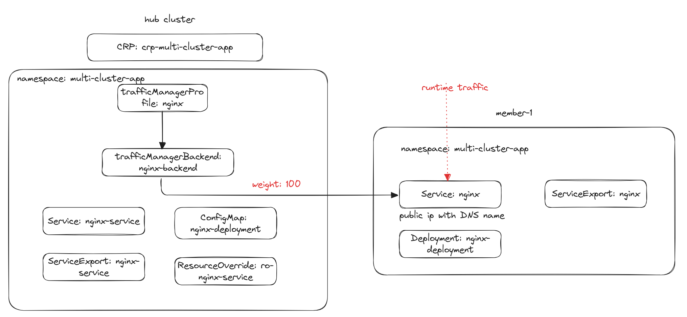
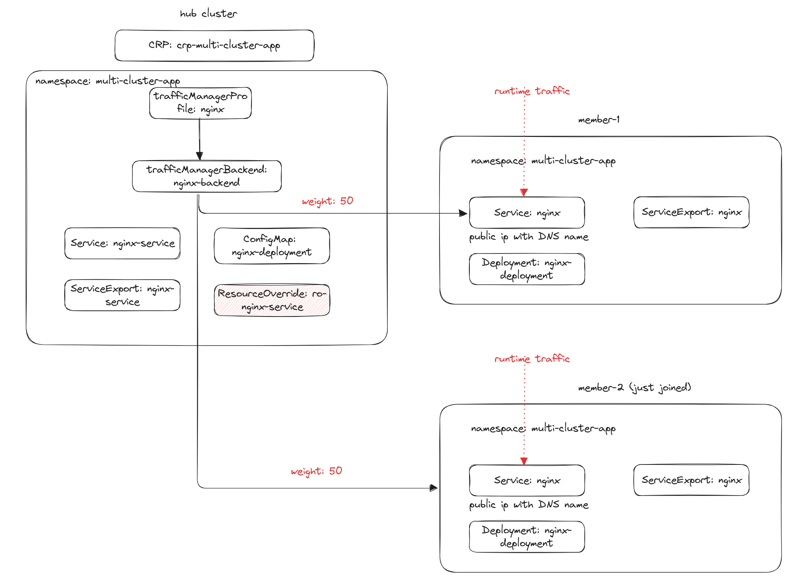

# Tutorial: Build a Multi-Cluster Application seamlessly with ClusterResourcePlacement and Multi-Cluster Networking APIs

This tutorial will guide you through the process of building a multi-cluster application using the ClusterResourcePlacement and Multi-Cluster networking APIs.

It will start with a single cluster running a set of application resources which are placed by the ClusterResourcePlacement API and override API.
The application traffic will be exposed via Azure Traffic Manager by using the fleet networking APIs.
When another cluster joins, the clusterResourcePlacement will propagate the workloads to the new cluster. 
The traffic will be automatically split between the clusters and failover to the healthy cluster when one of the clusters is unhealthy.

## Scenario
Your fleet consists of the following clusters:

1. Member Cluster 1 with label "cluster-name: member-1"

You have a set of application resources running on Member Cluster 1 and you want to serve the traffic from a new cluster, Member Cluster 2.

## Current Application Resources



The following resources are currently deployed in the hub cluster and use clusterResourcePlacement API to place them to the Member Cluster 1:

### Service
> Note: Service test file located [here](./testfiles/nginx-service.yaml).

```yaml
apiVersion: v1
kind: Namespace
metadata:
  name: multi-cluster-app
---
apiVersion: v1
kind: Service
metadata:
  name: nginx-service
  namespace: multi-cluster-app
spec:
  selector:
    app: nginx
  ports:
    - protocol: TCP
      port: 80
      targetPort: 80
  type: LoadBalancer
---
apiVersion: networking.fleet.azure.com/v1alpha1
kind: ServiceExport
metadata:
  name: nginx-service
  namespace: multi-cluster-app
```
The service is exposed using public IP and assigned a DNS name using [ro-nginx-service.yaml](./testfiles/ro-nginx-service.yaml)
and is visible to the fleet by creating ServiceExport.

```yaml
apiVersion: placement.kubernetes-fleet.io/v1alpha1
kind: ResourceOverride
metadata:
  name: nginx-service
  namespace: multi-cluster-app
spec:
  placement:
    name: crp-multi-cluster-app
  resourceSelectors:
    -  group: ""
       kind: Service
       version: v1
       name: nginx-service
  policy:
    overrideRules:
      - clusterSelector:
          clusterSelectorTerms:
            - labelSelector: {} # select all the clusters
        jsonPatchOverrides:
          - op: add
            path: /metadata/annotations
            value:
              {"service.beta.kubernetes.io/azure-dns-label-name":"multi-cluster-app-${MEMBER-CLUSTER-NAME}"}
```
> Note: "${MEMBER-CLUSTER-NAME}" is a [reserved variable](https://github.com/Azure/fleet/blob/main/docs/concepts/Override/README.md#reserved-variables-in-the-json-patch-override-value) in the override, and it will be replaced with the name of the member cluster.

> Note: Please update the dns label name to match your specific requirements, and the "multi-cluster-app-${MEMBER-CLUSTER-NAME}" may be not available.


Summary:
- This defines a Kubernetes Service named `nginx-service` in the `test-app` namespace.
- The service is of type LoadBalancer with a public ip address and a DNS name assigned.
- It targets pods with the label app: nginx and forwards traffic to port 80 on the pods.
- The override rule assigns a DNS name to the service based on the cluster name.

> Note: Please update the dns label name to match your specific requirements, and the "multi-cluster-app-${MEMBER-CLUSTER-NAME}" may be not available.


#### Deployment

> Note: Deployment test file located [here](./testfiles/envelop-object.yaml).

```yaml
apiVersion: v1
kind: ConfigMap
metadata:
  name: envelope-configmap
  namespace: multi-cluster-app
  annotations:
    kubernetes-fleet.io/envelope-configmap: "true"
data:
  nginx-deployment.yaml: |
    apiVersion: apps/v1
    kind: Deployment
    metadata:
      name: nginx-deployment
      namespace:  multi-cluster-app
    spec:
      replicas: 2
      selector:
        matchLabels:
          app: nginx
      template:
        metadata:
          labels:
            app: nginx
        spec:
          containers:
            - name: nginx
              image: nginx:1.16.1
              ports:
               - containerPort: 80
```
> Note: The current deployment has 2 replicas.

Summary:
- This defines a Kubernetes Deployment named `nginx-deployment` in the `test-app` namespace using envelop object wrapper, so that
  it won't create workloads in the hub cluster.
- It creates 2 replicas of the nginx pod, each running the `nginx:1.16.1` image.
- The deployment ensures that the specified number of pods (replicas) are running and available.
- The pods are labeled with `app: nginx` and expose port 80.

#### ClusterResourcePlacement

> Note: CRP Availability test file located [here](./testfiles/crp-multi-cluster-app.yaml)

```yaml
apiVersion: placement.kubernetes-fleet.io/v1
kind: ClusterResourcePlacement
metadata:
  name: crp-multi-cluster-app
spec:
  resourceSelectors:
    - group: ""
      kind: Namespace
      name: multi-cluster-app
      version: v1
  policy:
    placementType: PickAll
```

Summary:
- This defines a ClusterResourcePlacement named `crp-multi-cluster-app`.
- The placement policy selects all the existing cluster, member-1.
- It targets resources in the `multi-cluster-app` namespace.

### TrafficManagerProfile

To expose the service via Traffic Manager, you need to create a trafficManagerProfile resource in the `multi-cluster-app` namespace.

> Note: Profile test file located [here](./testfiles/nginx-profile.yaml) and please make sure the profile name (be part of the DNS name) is global unique.

> Note: Please make sure the hub networking controllers have the write permissions to create Traffic Manager Profile in the specified resourceGroup and
> the read permissions to read the public ip address of the service on the member clusters.

```yaml
apiVersion: networking.fleet.azure.com/v1alpha1
kind: TrafficManagerProfile
metadata:
  name: nginx-profile
  namespace: multi-cluster-app
spec:
  resourceGroup: "test-resource-group"
  monitorConfig:
    port: 80
```
Summary:
- This defines a Traffic Manager Profile named `nginx-profile` in the `multi-cluster-app` namespace.
- It listens on the specified port (80) for health checks.

```bash
kubectl get tmp -n multi-cluster-app
NAME            DNS-NAME                                             IS-PROGRAMMED   AGE
nginx-profile   multi-cluster-app-nginx-profile.trafficmanager.net   True            60s
```

### Exposing the Service as a Traffic Manager Endpoint

> Note:  nginx-backend file located [here](./testfiles/nginx-backend.yaml)

```bash
apiVersion: networking.fleet.azure.com/v1alpha1
kind: TrafficManagerBackend
metadata:
  ...
  name: nginx-backend
  namespace: multi-cluster-app
spec:
  backend:
    name: nginx-service
  profile:
    name: nginx-profile
  weight: 100
status:
  conditions:
    - lastTransitionTime: "2024-11-25T08:53:30Z"
      message: 1 service(s) exported from clusters have been accepted as Traffic Manager
        endpoints
      observedGeneration: 1
      reason: Accepted
      status: "True"
      type: Accepted
  endpoints:
    - from:
        cluster: member-1
        weight: 1
      name: fleet-90089f42-222a-4d9a-8a97-8b5ed2f9ca42#nginx-service#member-1
      target: fleet-multi-cluster-app-member-1.westcentralus.cloudapp.azure.com
      weight: 100
```
Summary:
- It defines a Traffic Manager Backend named `nginx-backend` in the `test-app` namespace.
- The weight is set to 100, which means all traffic is routed to this backend.

## Spreading the Application to Member Cluster 2



### Join Member Cluster 2 to the Fleet

you need to add the new cluster Member Cluster 2 with label "cluster-name: member-2"
as part of the fleet by installing fleet agents and creating MemberCluster API ([sample MemberCluster](./testfiles/member-cluster-2.yaml)) following [this document](https://github.com/Azure/fleet/blob/main/docs/howtos/clusters.md).

```bash
kubectl get membercluster -l cluster-name=member-2
NAME       JOINED   AGE   MEMBER-AGENT-LAST-SEEN   NODE-COUNT   AVAILABLE-CPU   AVAILABLE-MEMORY
member-2   True     16h   38s                      2            1848m           10318332Ki
```

### Validate the clusterResourcePlacement

To validate whether the resources are applied to the Member Cluster 2, you can check the status of the CRP object.

```bash
kubectl get crp crp-multi-cluster-app -o yaml
apiVersion: placement.kubernetes-fleet.io/v1
kind: ClusterResourcePlacement
metadata:
  ...
  name: crp-multi-cluster-app
spec:
  policy:
    placementType: PickAll
  resourceSelectors:
  - group: ""
    kind: Namespace
    name: multi-cluster-app
    version: v1
  revisionHistoryLimit: 10
  strategy:
    type: RollingUpdate
status:
  conditions:
  - lastTransitionTime: "2024-11-25T09:02:31Z"
    message: found all cluster needed as specified by the scheduling policy, found
      2 cluster(s)
    observedGeneration: 3
    reason: SchedulingPolicyFulfilled
    status: "True"
    type: ClusterResourcePlacementScheduled
  - lastTransitionTime: "2024-11-25T09:02:31Z"
    message: All 2 cluster(s) start rolling out the latest resource
    observedGeneration: 3
    reason: RolloutStarted
    status: "True"
    type: ClusterResourcePlacementRolloutStarted
  - lastTransitionTime: "2024-11-25T09:02:31Z"
    message: The selected resources are successfully overridden in 2 cluster(s)
    observedGeneration: 3
    reason: OverriddenSucceeded
    status: "True"
    type: ClusterResourcePlacementOverridden
  - lastTransitionTime: "2024-11-25T09:02:31Z"
    message: Works(s) are succcesfully created or updated in 2 target cluster(s)'
      namespaces
    observedGeneration: 3
    reason: WorkSynchronized
    status: "True"
    type: ClusterResourcePlacementWorkSynchronized
  - lastTransitionTime: "2024-11-25T09:02:31Z"
    message: The selected resources are successfully applied to 2 cluster(s)
    observedGeneration: 3
    reason: ApplySucceeded
    status: "True"
    type: ClusterResourcePlacementApplied
  - lastTransitionTime: "2024-11-25T09:02:57Z"
    message: The selected resources in 2 cluster(s) are available now
    observedGeneration: 3
    reason: ResourceAvailable
    status: "True"
    type: ClusterResourcePlacementAvailable
  observedResourceIndex: "14"
  placementStatuses:
  - applicableResourceOverrides:
    - name: ro-nginx-service-1
      namespace: multi-cluster-app
    clusterName: member-2
    conditions:
    - lastTransitionTime: "2024-11-25T09:02:31Z"
      message: 'Successfully scheduled resources for placement in "member-2" (affinity
        score: 0, topology spread score: 0): picked by scheduling policy'
      observedGeneration: 3
      reason: Scheduled
      status: "True"
      type: Scheduled
    - lastTransitionTime: "2024-11-25T09:02:31Z"
      message: Detected the new changes on the resources and started the rollout process
      observedGeneration: 3
      reason: RolloutStarted
      status: "True"
      type: RolloutStarted
    - lastTransitionTime: "2024-11-25T09:02:31Z"
      message: Successfully applied the override rules on the resources
      observedGeneration: 3
      reason: OverriddenSucceeded
      status: "True"
      type: Overridden
    - lastTransitionTime: "2024-11-25T09:02:31Z"
      message: All of the works are synchronized to the latest
      observedGeneration: 3
      reason: AllWorkSynced
      status: "True"
      type: WorkSynchronized
    - lastTransitionTime: "2024-11-25T09:02:31Z"
      message: All corresponding work objects are applied
      observedGeneration: 3
      reason: AllWorkHaveBeenApplied
      status: "True"
      type: Applied
    - lastTransitionTime: "2024-11-25T09:02:57Z"
      message: All corresponding work objects are available
      observedGeneration: 3
      reason: AllWorkAreAvailable
      status: "True"
      type: Available
  - applicableResourceOverrides:
    - name: ro-nginx-service-1
      namespace: multi-cluster-app
    clusterName: member-1
    conditions:
    - lastTransitionTime: "2024-11-25T09:02:31Z"
      message: 'Successfully scheduled resources for placement in "member-1" (affinity
        score: 0, topology spread score: 0): picked by scheduling policy'
      observedGeneration: 3
      reason: Scheduled
      status: "True"
      type: Scheduled
    - lastTransitionTime: "2024-11-25T09:02:31Z"
      message: Detected the new changes on the resources and started the rollout process
      observedGeneration: 3
      reason: RolloutStarted
      status: "True"
      type: RolloutStarted
    - lastTransitionTime: "2024-11-25T09:02:31Z"
      message: Successfully applied the override rules on the resources
      observedGeneration: 3
      reason: OverriddenSucceeded
      status: "True"
      type: Overridden
    - lastTransitionTime: "2024-11-25T09:02:31Z"
      message: All of the works are synchronized to the latest
      observedGeneration: 3
      reason: AllWorkSynced
      status: "True"
      type: WorkSynchronized
    - lastTransitionTime: "2024-11-25T09:02:31Z"
      message: All corresponding work objects are applied
      observedGeneration: 3
      reason: AllWorkHaveBeenApplied
      status: "True"
      type: Applied
    - lastTransitionTime: "2024-11-25T09:02:31Z"
      message: All corresponding work objects are available
      observedGeneration: 3
      reason: AllWorkAreAvailable
      status: "True"
      type: Available
  selectedResources:
  - kind: Namespace
    name: multi-cluster-app
    version: v1
  - group: networking.fleet.azure.com
    kind: ServiceExport
    name: nginx-service
    namespace: multi-cluster-app
    version: v1alpha1
  - kind: Service
    name: nginx-service
    namespace: multi-cluster-app
    version: v1
  - kind: ConfigMap
    name: envelope-configmap
    namespace: multi-cluster-app
    version: v1
```

### Validate the trafficManagerEndpoint

To validate whether the service of Member Cluster 2 is exposed via Traffic Manager, you can check the status of the TrafficManagerBackend object.

```bash
kubectl get tmb nginx-backend -n multi-cluster-app -o yaml
apiVersion: networking.fleet.azure.com/v1alpha1
kind: TrafficManagerBackend
metadata:
 ...
  name: nginx-backend
  namespace: multi-cluster-app
spec:
  backend:
    name: nginx-service
  profile:
    name: nginx-profile
  weight: 100
status:
  conditions:
  - lastTransitionTime: "2024-11-25T09:02:56Z"
    message: 2 service(s) exported from clusters have been accepted as Traffic Manager
      endpoints
    observedGeneration: 1
    reason: Accepted
    status: "True"
    type: Accepted
  endpoints:
  - from:
      cluster: member-1
      weight: 1
    name: fleet-90089f42-222a-4d9a-8a97-8b5ed2f9ca42#nginx-service#member-1
    target: fleet-multi-cluster-app-member-1.westcentralus.cloudapp.azure.com
    weight: 50
  - from:
      cluster: member-2
      weight: 1
    name: fleet-90089f42-222a-4d9a-8a97-8b5ed2f9ca42#nginx-service#member-2
    target: fleet-multi-cluster-app-member-2.westcentralus.cloudapp.azure.com
    weight: 50
```
Summary:
* The traffic is now split between the two clusters, member-1 and member-2, with a weight of 50% each.
* Similarly, when the cluster is left from the fleet by deleting memberCluster CR, all the placed resources excluding the fleet 
networking resources, will be left on the cluster, and the exported service will be removed from the Azure Traffic Manager automatically.

> Note: Azure Traffic Manager provides health monitoring for every endpoint. It means the traffic will be routed to the new cluster
> when the workloads on the cluster are healthy.
> 
> If you want to control when the traffic should be routed to the new cluster explicitly, you can refer to [Migrating Application Resources to Clusters without Downtime tutorial](../ApplicationMigration/ApplicationMigration.md).

## Automatic Fail Over When One cluster Is Unhealthy

[Azure Traffic Manager](https://learn.microsoft.com/en-us/azure/traffic-manager/traffic-manager-overview) includes built-in endpoint monitoring and automatic endpoint failover. If one of the clusters goes down, 
Traffic Manager will automatically direct the new connections to the healthy cluster.

> Note:
> Because Traffic Manager works at the DNS level, it cannot influence existing connections to any endpoint. 
> When it directs traffic between endpoints (either by changed profile settings, or during failover or failback), 
> Traffic Manager directs new connections to available endpoints. Other endpoints might continue to receive traffic via 
> existing connections until those sessions are terminated. To enable traffic to drain from existing connections, applications 
> should limit the session duration used with each endpoint.

## Conclusion
This tutorial demonstrated how to build a multi-cluster application seamlessly by using
clusterResourcePlacement, resourceOverrides, serviceExport, trafficManagerProfile and trafficManagerBackend APIs.
The traffic will be automatically split between the clusters and failover to the healthy cluster when one of the clusters is unhealthy.
